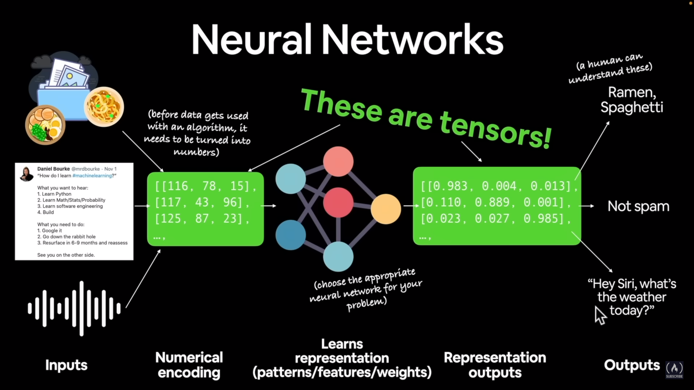

# Freecodecamp Pytorch Tutorial

Learning Pytorch using Daniel Bourke's video posted in Freecodecamp youtube channel

## What is Machine Learning

**Machine Learning is turning data(any type of data like images, audio, video, text etc.) into numbers and finding patterns in those numbers.** The pattern finding part is done by the computer using Machine/Deep Learning algorithms.

You need to use traditional Machine Learning algorithms (called `shallow algorithms`) when you have structured data (which can be represented using rows and columns). Example of such algorithms are - _XGBoost, Support Vector Machine, Naive Bayes, Gradient Boosted Models_ etc.

Types of Learning -

- **Supervised Learning** - In the dataset, for each input data we have the ideal output (called label).
- **Unsupervised Learning** - We don't have any labels in the dataset.
- **Transfer Learning** - Taking the patterns that one model has learned and transferring it to another model.
- **Reinforcement Learning**

## What is Deep Learning

Deep Learning is a subset of Machine Learning.

> **Deep Learning is used when you have unstructured data (for example - natural language, images, videos, audios).** In case of deep learning, we built something called a `Neural Network which is a series of algorithms`. Different types of neural networks - _Fully Connected Neural Network, Convolutional Neural Network, Recurrent Neural Network_ etc.

> Structure of a Neural Network - an **input layer** taking the unstructured data (numerically encoded) as input | hidden **operational layers** which learns `patterns/features/weights` from the input data | an **output layer** giving the output (in numerical representation). **Numerical representation of the output or the unstructured input data is called `tensor`**. Tensors is the fundamental building block of Deep Learning.



Deep Learning is used to build **recommendation engines**, for doing **translations, speech recognition, Computer Vision (CV), Natural Language Processing (NLP)** etc.

## What is PyTorch

Pytorch is an open-source Deep Learning framework initiated by Meta.

> Using Pytorch we can write fast Deep Learning code in Python which is able to run on one or more GPUs (PyTorch leverages **Cuda** for this). We can also run PyTorch code on **TPUs (Tensor Processing Units)**.

## Configuring PyTorch GPU access

Commands to install CUDA and cuDNN locally -

```
wget https://developer.download.nvidia.com/compute/cuda/repos/ubuntu2204/x86_64/cuda-ubuntu2204.pin &&
  sudo mv cuda-ubuntu2204.pin /etc/apt/preferences.d/cuda-repository-pin-600
wget https://developer.download.nvidia.com/compute/cuda/12.1.1/local_installers/cuda-repo-ubuntu2204-12-1-local_12.1.1-530.30.02-1_amd64.deb
sudo dpkg -i cuda-repo-ubuntu2204-12-1-local_12.1.1-530.30.02-1_amd64.deb
sudo cp /var/cuda-repo-ubuntu2204-12-1-local/cuda-*-keyring.gpg /usr/share/keyrings/
sudo apt-get update &&
  sudo apt-get -y install cuda

wget https://developer.nvidia.com/downloads/compute/cudnn/secure/8.9.1/local_installers/12.x/cudnn-local-repo-ubuntu2204-8.9.1.23_1.0-1_amd64.deb/ &&
  sudo dpkg -i cudnn-local-repo-ubuntu2204-8.9.1.23_1.0-1_amd64.deb
```

## Introduction to Tensors

Here is the related [notebook](./pytorch-fundamentals.ipynb).

Some more important PyTorch functions related to Tensors - `torch.arange( )`, `torch.zeros_like( )`.
